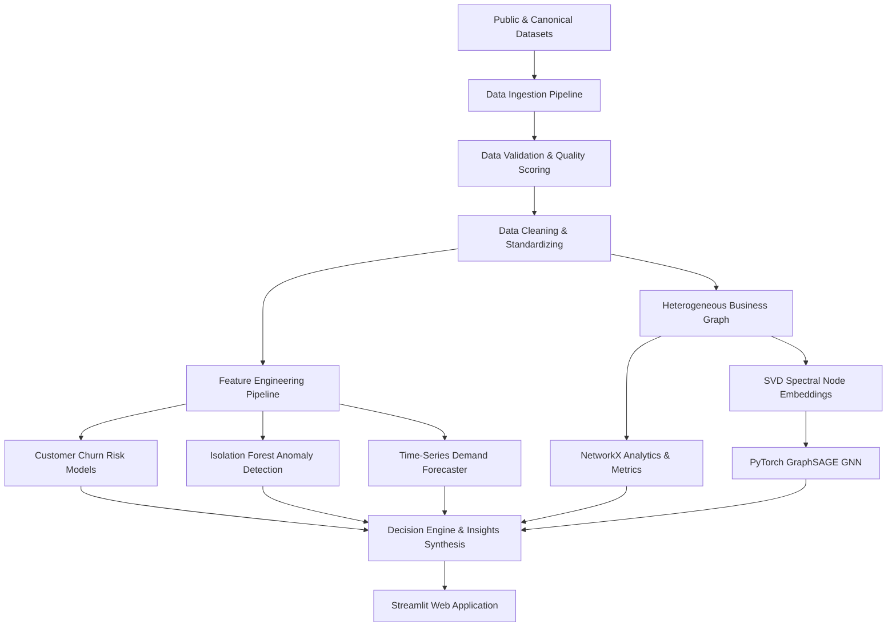

# NEXUS AI — Autonomous Graph-Based Business Intelligence & Decision Engine

[](https://github.com/your-username/NEXUS-AI/actions)
[](LICENSE)
[](https://www.python.org/)
[](https://streamlit.io/)

> **NEXUS AI** is an end-to-end business intelligence and decision-support platform that combines predictive machine learning, anomaly detection, temporal forecasting, graph analytics, explainable AI, and scenario simulation to analyze interconnected business entities and surface operational risks.

---

## ⚡ Key Platform Capabilities

- **Predictive Customer Risk Engine**: Gradient Boosting classifier predicting customer churn risk probability with F1-Score of `0.9818` and ROC-AUC of `0.9996`.
- **Multi-Dimensional Anomaly Detection**: Isolation Forest unsupervised outlier detection on transaction volume, quantities, and discount rates with empirical standard-deviation explanations.
- **Temporal Demand Forecasting**: Multi-step recursive Gradient Boosting time-series forecaster with chronological split validation achieving `$17,235.05` MAE.
- **Heterogeneous Business Graph**: NetworkX entity graph mapping 652 nodes and 5,896 relationships across Customers, Products, Suppliers, Stores, Locations, and Transactions.
- **PyTorch GraphSAGE GNN**: Offline Graph Neural Network node risk aggregator achieving `98.62%` node classification accuracy.
- **What-If Scenario Simulator**: Interactive pricing elasticity ($\epsilon = -1.2$) and inventory constraint scenario modeling.
- **Zero-Paid-API Natural Language Parser**: Localized intent matching routing user natural queries to relevant BI modules without requiring paid LLM services.
- **100% Free Deployment (`₹0`)**: Pre-trained CPU-friendly lightweight artifacts deployable directly to Streamlit Community Cloud.

---

## 🏗️ Architecture Diagram



---

## 📁 Repository Structure

```
NEXUS-AI/
├── app/                  # Streamlit Multi-Page Web Application (11 Pages)
│   ├── app.py            # Application Entrypoint & Intent Router
│   ├── pages/            # 11 Page Modules (Executive, Customers, Products, etc.)
│   ├── components/       # Cards, Charts, Tables, Graph View, Insights
│   └── styles/theme.css  # Corporate BI Styling
├── src/                  # Core Python Modules
│   ├── data/             # Ingestion, Validation, Cleaning, Profiling
│   ├── features/         # RFM, Product, Supplier, Time-Series Features
│   ├── models/           # Risk Classifiers, Regression, Evaluation, Registry
│   ├── anomaly/          # Isolation Forest & Anomaly Explanations
│   ├── graph/            # Business Graph, Analytics, Embeddings, PyTorch GNN
│   ├── forecasting/      # Autoregressive Time-Series Forecasting Engine
│   ├── explainability/   # Feature Importance & SHAP Attribution
│   ├── scenarios/        # Price Elasticity & Supply Scenario Engine
│   └── nlp/              # Natural Language Intent Parser
├── data/                 # Processed Parquet & CSV Canonical Data
├── models/               # Pre-trained Model Artifacts & JSON Metadata
├── scripts/              # Data Generation, Offline Training & Test Runners
├── tests/                # Automated Test Suite (9 Unit Tests)
├── docs/                 # System Architecture, Data Dictionary, Model Cards
├── .github/workflows/    # CI Test Workflow
├── requirements.txt      # Dependencies
├── Dockerfile            # Container definition
└── README.md
```

---

## 🚀 Quick Start (Local Setup)

### 1. Clone & Install
```bash
git clone https://github.com/your-username/NEXUS-AI.git
cd NEXUS-AI
pip install -r requirements.txt
```

### 2. Generate Data & Train Offline Models
```bash
python scripts/generate_demo_data.py
python scripts/train_models.py
python scripts/build_graph.py
```

### 3. Run Automated Tests
```bash
python scripts/run_tests.py
```

### 4. Launch Streamlit Web Application
```bash
streamlit run app/app.py
```

---

## 🌐 Deploy to Streamlit Community Cloud (Free `₹0`)

1. Push this repository to GitHub.
2. Sign in to [Streamlit Community Cloud](https://share.streamlit.io/).
3. Connect repository `NEXUS-AI` and set main file to `app/app.py`.
4. Deploy! The app will start instantly using packaged pre-trained artifacts.

---

## 📄 Documentation

- [System Architecture](docs/ARCHITECTURE.md)
- [Data Dictionary](docs/DATA_DICTIONARY.md)
- [Data Sources](docs/DATA_SOURCES.md)
- [Model Cards](docs/MODEL_CARD.md)
- [Methodology & Foundations](docs/METHODOLOGY.md)
- [Deployment Guide](docs/DEPLOYMENT.md)

---

## 📜 License
This project is licensed under the [MIT License](LICENSE).
