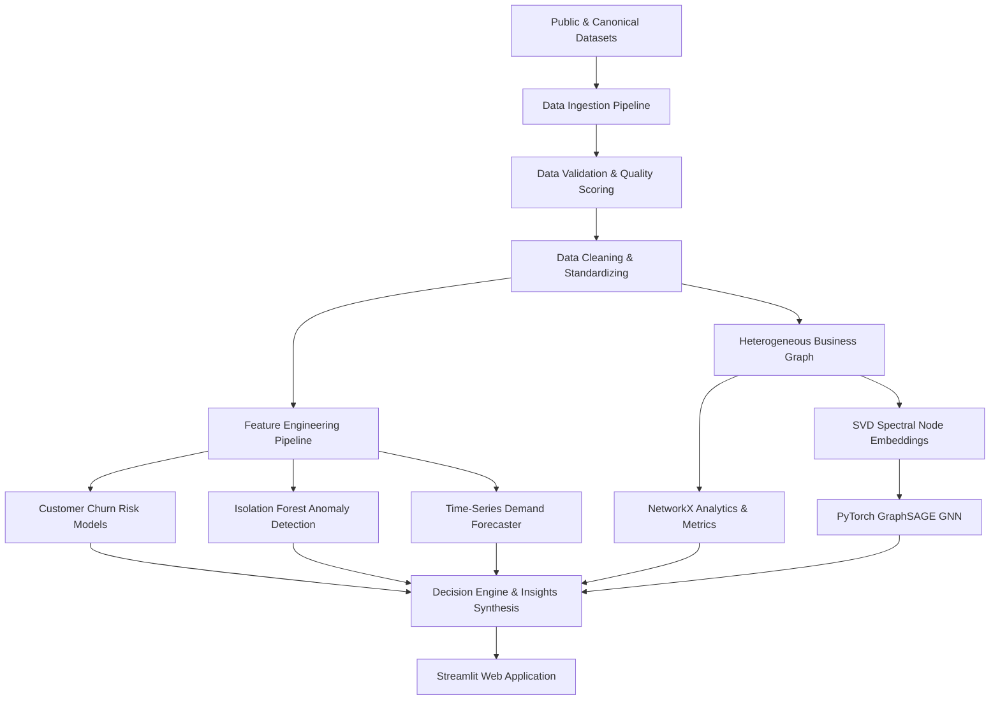

# ARCHITECTURE DOCUMENTATION — NEXUS AI

NEXUS AI is an end-to-end, autonomous graph-based business intelligence and decision-support engine.

## 1. System Architecture Diagram

## 2. Subsystem Components

- **Data Ingestion & Quality**: `src/data/` (ingestion, cleaning, validation, profiling). Calculates real-time Data Quality Score (e.g. 100.0%).
- **Predictive ML**: `src/models/` (Logistic Regression, Random Forest, Gradient Boosting classifiers).
- **Anomaly Detection**: `src/anomaly/` (Isolation Forest for multi-dimensional statistical deviations).
- **Temporal Forecasting**: `src/forecasting/` (Recursive multi-step Gradient Boosting with lag & rolling statistics).
- **Graph Intelligence**: `src/graph/` (Heterogeneous NetworkX topology + PyTorch GraphSAGE node aggregator).
- **What-If Scenario Simulator**: `src/scenarios/` (Price elasticity and supply constraint simulation).
- **Natural Language Intent Interface**: `src/nlp/` (Zero-paid-API keyword/regex intent router).
- **Web Application**: `app/` (11-page modular Streamlit enterprise UI).
